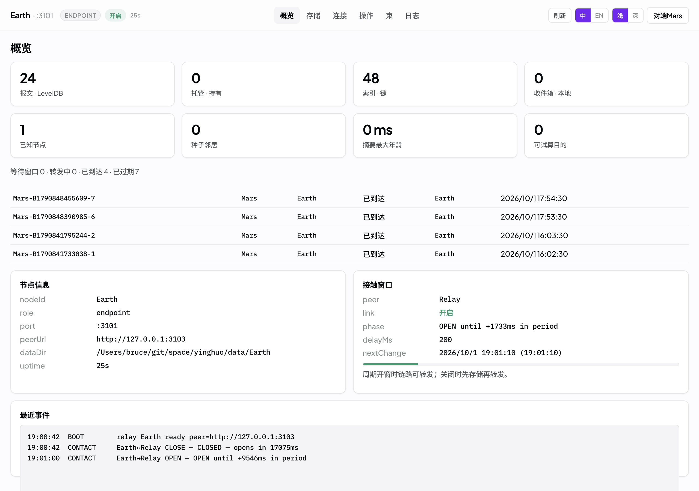
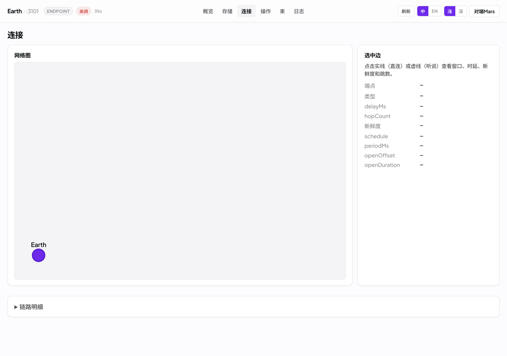
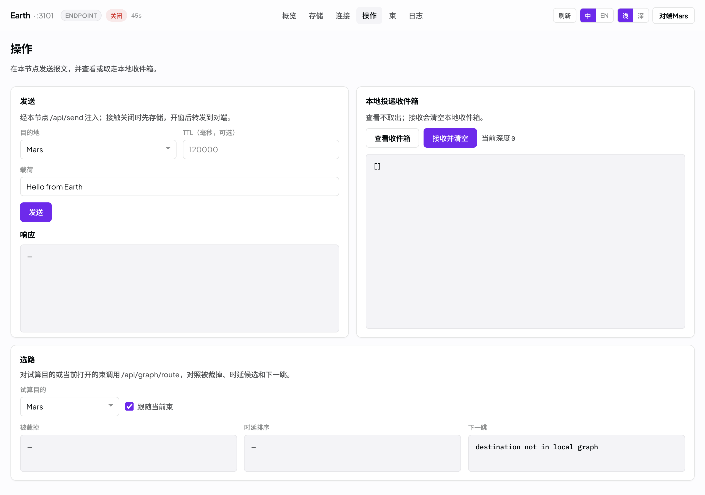
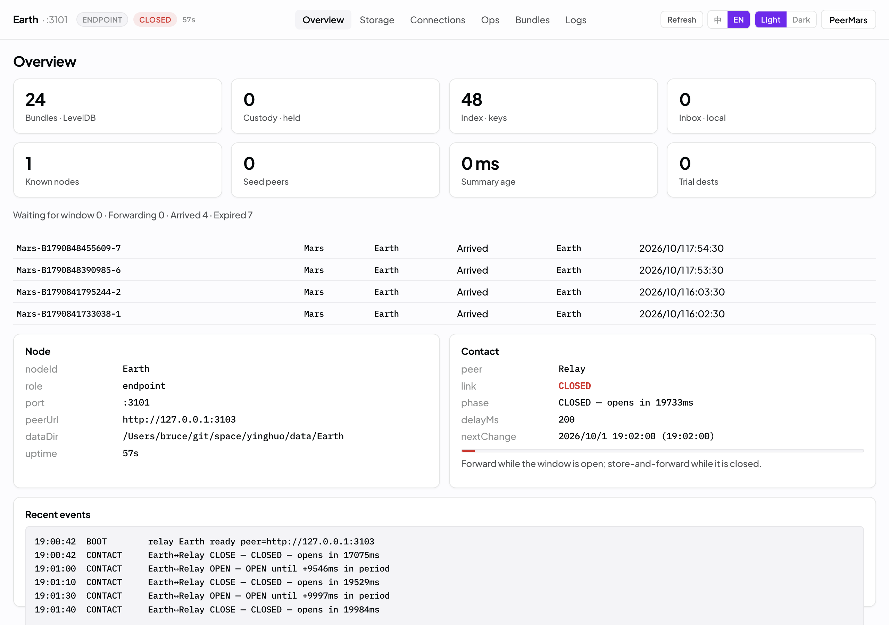
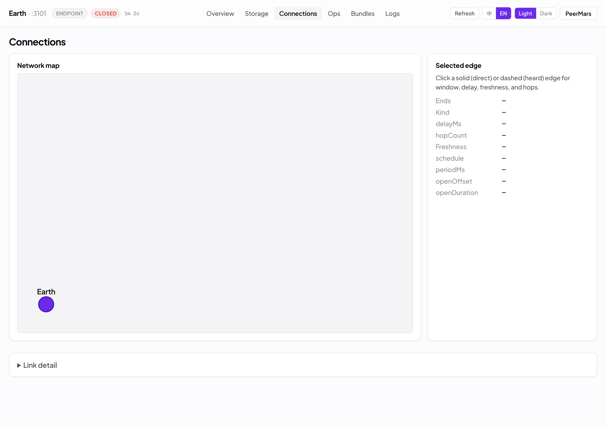
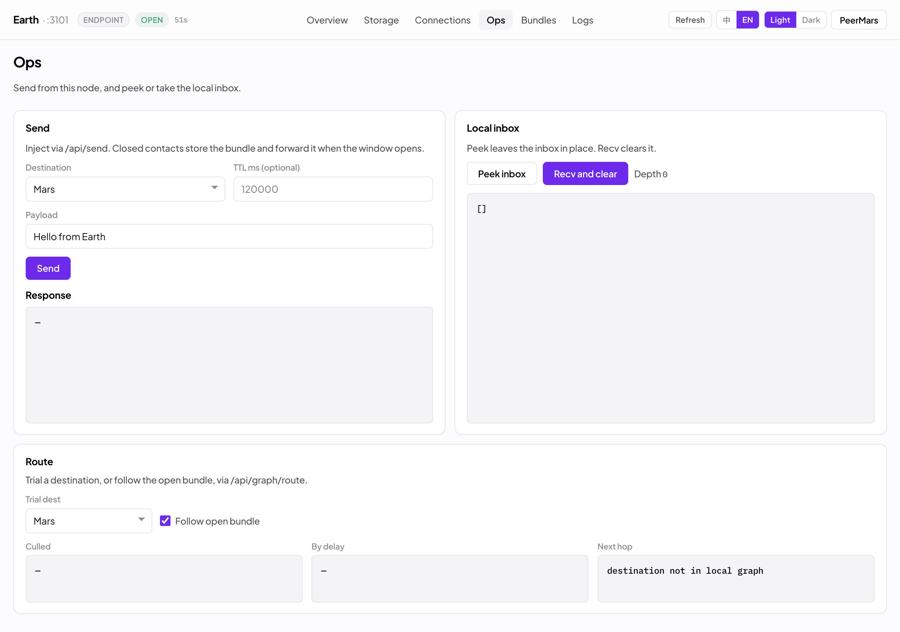

# DTN 萤火束递网（Yinghuo）

**DTN Yinghuo Bundle Delivery Fabric** 面向延迟与中断容忍场景下的报文投递：节点之间链路可能长时间断开、传播时延可达秒级乃至更久，系统在接触窗口关闭时本地保管，窗口打开后再逐跳转发，直到目的端投递完成。

默认部署 Earth → Relay → Mars 三跳路径，也可切换为接触图模式，由节点动态加入、交换局部拓扑，并按距离、时延与角色偏置选择下一跳。线上报文采用 BPv7 CBOR。调用入口分层：

- **Agent**：`@yinghuo/mcp`（stdio MCP）
- **人／脚本**：HTTP API、CLI、SDK
- **监督**：萤火控制台（审批、看板、审计、例外）

远期愿景见 [`docs/vision.md`](./docs/vision.md)。现状与愿景差距台账见 [`docs/todo.md`](./docs/todo.md)（近程已交付；当前主战场为中期）。

## 控制台截图

萤火控制台（Yinghuo Console）内置中英文切换。以下为 Earth 节点（`:3101`）界面。

### 中文

**概览**



**连接**



**操作**



### English

**Overview**



**Connections**



**Ops**



## 能力概览

| 能力 | 说明 |
|------|------|
| 三节点 store-and-forward | 默认 Earth → Relay → Mars；接触窗口错开，无 Earth↔Mars 直连；关窗保管、开窗转发 |
| Bundle 状态机 | `WAITING` → `FORWARDING` → `ARRIVED`／`ACKED`／`EXPIRED`；逐跳 custody ACK；TTL 过期；同 id 去重 |
| BPv7 线上编解码 | NASA bplib + QCBOR（`koffi` FFI）；节点间 `Content-Type: application/cbor`；共享库缺失时启动失败 |
| 业务／网络／运维分层 | 发送与收件箱仅暴露节点名与载荷；连接页展示 EID／窗口；束详情含主块摘要与时间线 |
| 可配置 EID | 接触计划或环境变量映射节点名 ↔ `ipn:…` |
| 接触图模式 | `DTN_GRAPH_MODE=1`：引导加入、摘要 gossip；选路先裁更远邻居，再选等待开窗 + 时延 + 角色偏置最小者 |
| 节点角色 | `ground`／`orbiter`／`lander`／`cruise`（旧名兼容）；影响可发／中继／保管文案／选路偏好 |
| 计划热更新 | `POST /api/plan/reload`＋文件监视；`GET /api/plan` 看版本／错误；校验失败不覆盖生效计划 |
| MCP（Agent） | `@yinghuo/mcp` stdio：本地 Agent 调 status／contacts／graph／send／inbox／plan_reload |
| 动态加入／多岛 | `join`／`graph`／`graph/join`；`join-cluster.sh`／`dual-island.sh`／`unhealthy-retry.sh` |
| 萤火控制台 | 各节点 `/`：概览、存储、连接、操作、束、日志（人类监督面） |
| CLI／SDK | `status`／`send`／`recv`／`wait`；`@yinghuo/sdk` 订阅投递 |
| 测试 | `npm run smoke`（默认单元）；`SMOKE_LIVE=1 npm run smoke`（含 live 脚本）；分项见「测试」节 |

## 仓库结构

```
yinghuo/
├── AGENTS.md
├── README.md
├── docs/screenshots/            # 控制台截图（中／英）
├── docs/vision.md               # 愿景：太阳系上的束递网
├── docs/todo.md                 # 相对愿景的近／中／远差距台账
├── docs/relay-daemon-design.md
├── docs/superpowers/specs/      # 三节点 / bplib / 接触图 / MCP 设计
├── docs/superpowers/plans/      # 对应实现计划
├── docs/k8s-dtn-scheduling.md
├── k8s/
├── data/Earth|Relay|Mars/       # LevelDB×3（gitignore）
├── native/bp-codec/             # bplib 薄包装 + CMake（.dylib / .so）
├── native/third_party/          # QCBOR、bplib（脚本拉取）
├── packages/dtn-core/           # 旧离散仿真核心
├── packages/dtn-sdk/
├── packages/dtn-cli/
├── packages/yinghuo-mcp/        # stdio MCP（Agent 入口）
├── apps/relay/                  # NestJS relay（主路径）
├── apps/api/                    # 旧仿真 Nest API :3001
└── apps/web/                    # Next.js 接触计划 + 旧仿真 UI
```

## 快速开始

```bash
cd yinghuo
npm install

# 首次或升级后：编译 bplib BPv7 共享库（macOS .dylib / Linux .so）
npm run native:build -w @yinghuo/relay

# 终端 1 — Earth :3101
npm run relay:earth

# 终端 2 — Relay :3103
npm run relay:relay

# 终端 3 — Mars :3102
npm run relay:mars

# 终端 4（可选）— CLI
npm run cli -- status
DTN_NODE=Earth npm run cli -- send Mars "Hello Mars"
DTN_NODE=Mars  npm run cli -- wait 60

# 可选：Next.js 接触计划页 :3000（需三个 relay 已启动）
npm run web
# http://localhost:3000/
# 控制台：http://127.0.0.1:3101/ 、http://127.0.0.1:3103/ 、http://127.0.0.1:3102/
```

默认接触计划为 `apps/relay/contact-plan.tri.json`（周期 30s，两段窗口错开：Earth–Relay 在 `[0s,10s)` 打开，Relay–Mars 在 `[15s,25s)` 打开；任意时刻无 Earth↔Mars 直连）。节点角色：Earth=`ground`、Relay=`orbiter`、Mars=`lander`（亦兼容旧名 `endpoint`／`relay`／`hybrid`）。

长时延示例计划 `apps/relay/contact-plan.tri-long.json`：周期 5 分钟；Earth–Relay 开窗 90s、传播时延 15s；Relay–Mars 开窗错开至周期中段、传播时延 30s。启动：

```bash
npm run relay:earth:long
npm run relay:relay:long
npm run relay:mars:long
```

绝对窗口示例 `apps/relay/contact-plan.tri-absolute.json`：`schedule.type = absolute`，窗口可用 `offsetStartMs`／`offsetEndMs`（相对进程启动）或墙钟 `startMs`／`endMs`（小于约 2001 的毫秒值亦按偏移解析）。两段错开弧：Earth–Relay 在启动后约 5–65s 与 3–4min；Relay–Mars 在约 1.5–2.5min 与 4.5–5.5min。启动：

```bash
npm run relay:earth:abs
npm run relay:relay:abs
npm run relay:mars:abs
```

控制台接触区会显示人性化的 `phase`／`remain`／`delay`（如 `OPEN — closes in 1m 12s`）；absolute 计划下进度条按当前／下一弧剩余比例填充。

### 端口与路径

| 节点 | 端口 | 下一跳 / Peer | LevelDB |
|------|------|---------------|---------|
| Earth | 3101 | Relay `http://127.0.0.1:3103` | `data/Earth/{bundles,custody,index}/` |
| Relay | 3103 | Earth / Mars | `data/Relay/{bundles,custody,index}/` |
| Mars | 3102 | Relay `http://127.0.0.1:3103` | `data/Mars/{bundles,custody,index}/` |

关窗时发往下一跳的 bundle 进入 `WAITING`（保管）；开窗后经 `FORWARD` 等状态完成投递，目的端可通过 `recv`／`wait` 取走；源端可在控制台时间线观察到 `ARRIVED`。转发前由 bplib 编码为 CBOR，成功后方进入 `FORWARDING`（编码失败不进入转发）。

相关环境变量：`NODE_ID`、`PORT`、`PEER_URL`、`DATA_DIR`、`CONTACT_PLAN`、`EID`、`ROLE`、`DTN_PLAN_WATCH`。CLI 可通过 `DTN_RELAY_URL` 或 `DTN_NODE=Earth|Relay|Mars` 指定节点。

改接触窗后无需重启：

```bash
# 改完 CONTACT_PLAN 指向的 JSON 后
curl -s -X POST http://127.0.0.1:3101/api/plan/reload
curl -s http://127.0.0.1:3101/api/plan
```

### MCP（本机 Agent）

stdio MCP 包 `@yinghuo/mcp` 把 relay HTTP 运维面暴露给 Cursor／Claude 等本机 Agent（GUI 仍是人类监督面）。

```bash
# 需已启动至少一个 relay，例如 npm run relay:earth
npm run mcp
```

Cursor `mcpServers` 示例（把 `cwd` 换成仓库根路径）：

```json
{
  "mcpServers": {
    "yinghuo": {
      "command": "npx",
      "args": ["tsx", "packages/yinghuo-mcp/src/main.ts"],
      "cwd": "/path/to/yinghuo",
      "env": {
        "DTN_RELAY_URL": "http://127.0.0.1:3101"
      }
    }
  }
}
```

工具：`yinghuo_status`、`yinghuo_contacts`、`yinghuo_plan`、`yinghuo_plan_reload`、`yinghuo_graph`、`yinghuo_graph_route`、`yinghuo_send`、`yinghuo_inbox`。环境变量同 CLI：`DTN_RELAY_URL`／`YINGHUO_RELAY_URL`／`DTN_NODE`。

### Bundle 生命周期

| 状态 | 含义 |
|------|------|
| `WAITING` | 关窗或尚无可用下一跳；LevelDB custody 持有 |
| `FORWARDING` | 已编码并正在向 peer ingest |
| `ARRIVED` | 目的端本地投递；上游可收到 ACK |
| `ACKED` | 保管释放确认 |
| `EXPIRED` | TTL 到期（含收件箱过期清理） |

时间线事件（STORED / FORWARD / RETRY / ARRIVED / ACKED / …）可在控制台「束」页或 `GET /api/bundles/:id` 查看。

### 接触图模式（动态加入）

启用 `DTN_GRAPH_MODE=1` 后，转发不再依赖计划中的静态 `nextHop`：

1. 引导节点：不设置 `BOOTSTRAP_URL`。
2. 加入节点：设置 `BOOTSTRAP_URL`、本机 `PEER_URL`、`EID`、`NODE_X`／`NODE_Y` 与独立 `PORT`；启动时调用 `POST /api/peer/join`。
3. 摘要交换：约每 2s 在已打开的直连边上通过 `POST /api/peer/graph` 交换接触摘要（节点坐标、边、窗口、时延、hopCount）。
4. 选路：仅考虑直连且健康的邻居；先剔除距目的更远者，再在剩余候选中选择「等待开窗 + delayMs + 角色偏置」最小者；转发失败将邻居标记为 unhealthy 后重试。

运维接口：`GET /api/graph` 返回局部图；`GET /api/graph/route?dst=` 返回裁剪结果、时延候选与下一跳（控制台「连接」「操作」页同步展示）。

十节点冒烟示例（引导 `node0`，`node1`–`node9` 加入；`node1`–`node8` 置于 x 负半轴，避免被选为下一跳）：

```bash
bash apps/relay/scripts/join-cluster.sh
# 默认端口 3320–3329；收件箱等待 JOIN_TIMEOUT_SEC=120
JOIN_KEEP=1 bash apps/relay/scripts/join-cluster.sh
DTN_LIVE_GRAPH=1 npm test -w @yinghuo/relay -- src/live-graph-join.test.ts

# 两引导岛各自生长；BRIDGE=1 时 bridge 再 join 对岸并观测合并
bash apps/relay/scripts/dual-island.sh
BRIDGE=1 bash apps/relay/scripts/dual-island.sh
JOIN_KEEP=1 BRIDGE=1 bash apps/relay/scripts/dual-island.sh
DTN_LIVE_DUAL=1 DTN_LIVE_DUAL_BRIDGE=1 npm test -w @yinghuo/relay -- src/live-dual-island.test.ts
```

未设置 `DTN_LIVE_GRAPH=1`／`DTN_LIVE_DUAL=1` 时对应测试跳过。在当前星型拓扑下终止 `node1`–`node8` 中的进程，不会改变 `node0 → node9` 的直连路径；若需观察绕路，拓扑须为网状或短链（至少存在两个更近且可继续前传的邻居）。`GET /api/graph` 含 `stats.componentCount` 与节点 `componentId`（弱连通簇）；控制台按簇描边着色。

#### 故障邻居与摘要年龄

转发失败（graph 模式）会将下一跳标为 unhealthy，默认回避 `DTN_UNHEALTHY_MS`（默认 30s，可用环境变量缩短）；束在窗口内约每 1s `RETRY`。`GET /api/graph` 返回 `unhealthy[]`、`peers[].unhealthy`，以及听说边的 `ageMs`／`stale`（年龄超过 `DTN_HEARD_STALE_MS`，默认 60s，**仅展示**，不参与选路——选路只看直连 peer）。

```bash
bash apps/relay/scripts/unhealthy-retry.sh
# 默认 DTN_UNHEALTHY_MS=15000；alt/near 以 ROLE=relay 中继；杀 alt → 改走 near → 投递 dst → 窗口过后清除 unhealthy
```

### BPv7 编解码（bplib）

| 变量 | 说明 |
|------|------|
| （默认） | `native/bp-codec/build/libdtn_bp_codec.dylib`（Darwin）或对应 `.so`（Linux） |
| `DTN_BP_CODEC_LIB` | 覆盖共享库路径；缺失时进程启动失败 |
| `DTN_ALLOW_JSON_INGEST=1` | 允许 `POST /api/peer/ingest` 额外接受旧版 JSON（回归用）；默认关闭，出口仍为 CBOR |

导出接口：`dtn_bp_encode`／`dtn_bp_decode`／`dtn_bp_inspect`。构建说明见 [`native/bp-codec/README.md`](./native/bp-codec/README.md)。

### 萤火控制台（Yinghuo Console）

各 relay 进程在根路径 `/` 提供内置控制台（例如 `http://127.0.0.1:3101/`）。顶栏依次为节点名与端口、角色／接触状态／uptime、主导航，以及刷新、语言、主题与对端入口。

| 页 | 视图分层 | 内容 |
|----|----------|------|
| 概览 | 总览 | 存储深度、已知节点、近期束、节点信息、接触窗口 |
| 存储 | 运维 | bundles／custody／index／inbox 深度 |
| 连接 | 网络 | 坐标网络图、边明细、接触计划、EID、选路对照 |
| 操作 | 业务 | 发送／收件箱（仅节点名与载荷）；选路试算 |
| 束 | 运维 | 列表、状态、时间线、主块摘要（`primary`）、束长度 |
| 日志 | 运维 | `recentEvents` 刷新 |

业务 API：`POST /api/send` 成功响应仅包含 `ok,id,src,dst,payload,ttlMs`；`GET /api/inbox` 与 `GET /api/recv` 不含 EID。运维接口：`GET /api/bundles`、`GET /api/bundles/:id`。

### HTTP API 摘要

| 方法 | 路径 | 说明 |
|------|------|------|
| GET | `/api/health` | 健康检查 |
| GET | `/api/status` | 节点、角色能力／计划元数据、三库深度、接触、近期事件 |
| GET | `/api/contacts` | 接触窗口；含 `plan` 元数据；`wireFormat: application/cbor` |
| GET | `/api/plan` | 接触计划版本／来源／校验错误 |
| POST | `/api/plan/reload` | 热更新（磁盘或 body）；失败保留旧计划 |
| GET | `/api/graph` | 局部接触图（含 `componentCount`／`componentId`／`unhealthy`） |
| POST | `/api/graph/join` | 运行时再 join 另一引导（桥／多岛） |
| GET | `/api/graph/route?dst=` | 选路试算 |
| POST | `/api/peer/join` | 动态加入 |
| POST | `/api/peer/graph` | 接触摘要 gossip |
| POST | `/api/send` | 本地注入 |
| GET | `/api/recv` · `/api/inbox` | 收件箱 |
| GET | `/api/bundles` · `/api/bundles/:id` | 列表 / 运维详情 |
| POST | `/api/peer/ingest` | CLA（默认 CBOR） |
| POST | `/api/peer/ack` | 保管释放 |
| GET | `/` | 萤火控制台 |

### 可选：双节点对照（Earth↔Mars 直连）

仓库仍保留 `apps/relay/contact-plan.dual.json`（周期 20s，`[5s,15s)` 为 OPEN）。仅运行两个进程时，显式指定该计划并省略中间 Relay：

```bash
CONTACT_PLAN=apps/relay/contact-plan.dual.json npm run relay:earth
CONTACT_PLAN=apps/relay/contact-plan.dual.json npm run relay:mars
```

### CLI 一览

```bash
npm run cli -- help
npm run cli -- status
npm run cli -- send Mars "payload"
npm run cli -- recv
npm run cli -- inbox
npm run cli -- wait 60
```

### SDK（`@yinghuo/sdk`）

```ts
import { DtnClient, marsClient } from '@yinghuo/sdk';

const earth = new DtnClient({ baseUrl: 'http://127.0.0.1:3101' });
await earth.send('Mars', 'Hello');
const msgs = await marsClient().subscribeDelivery({ timeoutMs: 60000 });
```

## 离散仿真路径（可选）

```bash
npm run demo                 # CLI 离散仿真
npm run api                  # Nest 仿真 API :3001
npm run web                  # Next UI :3000（时间线 + /replay）
```

| 方法 | 路径 | 说明 |
|------|------|------|
| GET | `/api/health` | 健康检查 |
| POST | `/api/simulate` | 跑仿真并持久化到 LevelDB runs |
| GET | `/api/runs` | 运行列表 |

仿真 runs：`apps/api/data/dtn-runs/`（gitignore）。

## Kubernetes（Future / dry-run）

```bash
kubectl apply --dry-run=client -k k8s/
```

三节点（Earth↔Relay↔Mars）及真实编排说明见设计文档 Future 章节；本阶段不强制部署集群。

## 三节点时序场景

| 阶段 | 事件 |
|------|------|
| Earth–Relay CLOSED | Earth `send` → 本机 `WAITING`／STORED；载荷已编码并写入 custody |
| Earth–Relay OPEN | Earth → Relay CBOR ingest；Relay 保管并等待 Relay–Mars 窗口 |
| Relay–Mars OPEN | Relay → Mars 投递，并回传 ACK |
| 本地投递 | Mars `recv` 或 SDK `subscribeDelivery`；Earth 控制台可见 `ARRIVED` |

## 测试

萤火控制台概览区展示计划信任条（版本／校验 ok·warn、来源、路径、监视状态）；热更失败保留旧计划并显示横幅，可点「从磁盘重新加载」触发 `POST /api/plan/reload`。

```bash
npm run smoke                                               # 近栈冒烟：relay + mcp 单元；可选探测本机 relay HTTP
SMOKE_LIVE=1 npm run smoke                                  # 另跑 dual-island + unhealthy-retry（占端口，慎用）
SMOKE_STRICT=1 npm run smoke                                # 无 relay 时 MCP 探测失败即非零退出
npm run test:relay                                          # relay 单元（graph / codec / 状态机 / 角色 / 计划）
npm test -w @yinghuo/mcp                                    # MCP HTTP 客户端单元
DTN_LIVE_SMOKE=1 npm run test:relay:live                    # 三节点 live（需 3101/3102/3103）
DTN_LIVE_GRAPH=1 npm test -w @yinghuo/relay -- src/live-graph-join.test.ts
DTN_LIVE_DUAL=1 DTN_LIVE_DUAL_BRIDGE=1 npm test -w @yinghuo/relay -- src/live-dual-island.test.ts
bash apps/relay/scripts/unhealthy-retry.sh                  # unhealthy 故障切换冒烟
```

## 许可

MIT
